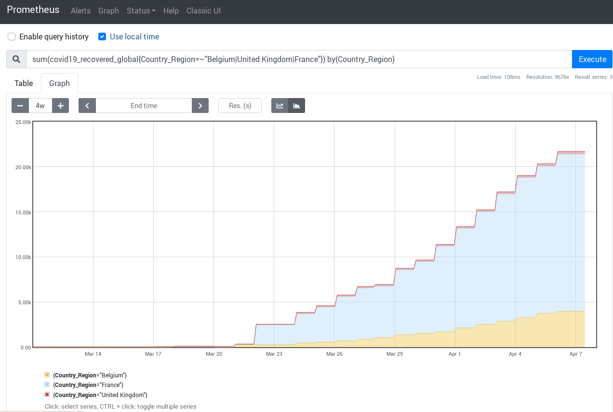

# prometheus_covid19

This is a remote read storage adapter for [Prometheus](https://prometheus.io).
This is a hack I made to learn about Remote Read in Prometheus and to manipulate
Covid19 data with PromQL.



## Usage

1. Clone this repository

```shell
$ git clone https://github.com/roidelapluie/prometheus_covid19
$ cd prometheus_covid19
```

2. Clone the data (I do not provide the data). This adapter uses the covid19
   JHU CSSE data set.

```shell
$ git clone https://github.com/CSSEGISandData/COVID-19
```

3. Run the remote adapter (you will need a functional golang setup)

```shell
$ go run *.go
```

## Prometheus setup

[Download Prometheus](https://prometheus.io/download/).

Exemple prometheus.yml:

```yaml
remote_read:
  - url: http://127.0.0.1:8080/read
    read_recent: true
```

Launch prometheus with a big lookback delta, as the data has a 24h granularity:

```shell
$ ./prometheus --query.lookback-delta=36h
```


## Metrics

The metrics you have access to depends on the CSV files in the data set.

At the time of writing, you have access to the following metrics:

- covid19_confirmed_global
- covid19_confirmed_US
- covid19_deaths_global
- covid19_deaths_US
- covid19_recovered_global

## Update the data set

Update the git repo and launch the remote read adapater again. The adapter reads
the data at startup.

```shell
$ cd COVID-19
$ git pull
$ cd ..
```

## About this work

I do not guarantee the quality of this work, it was done quickly and only for
hacking.

Pull requests are accepted.

This work is licensed under Apache-2.0 license.
